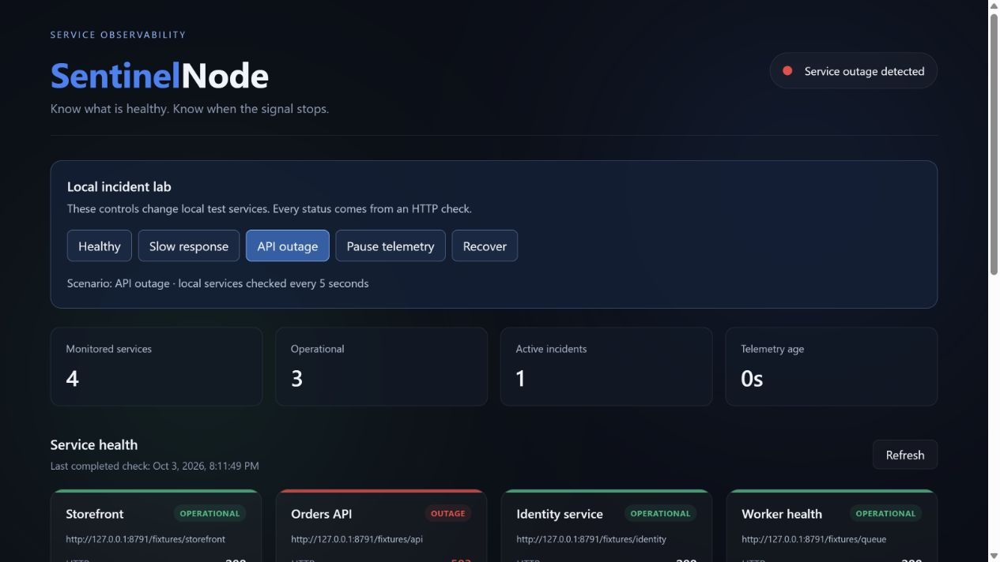
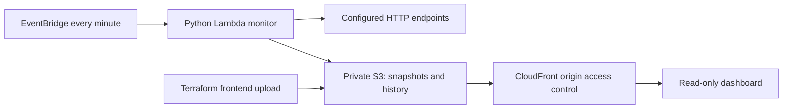

# SentinelNode

[](https://github.com/SoleVagabond/sentinel-node/actions/workflows/checks.yml)

Sentinel is a single-operator HTTP monitoring application. Configure services, run scheduled checks, investigate incidents, retry failed notifications, and retain observations in a private SQLite database. Its dashboard separates an observed service failure from a monitor that has stopped reporting.

The application runs on your computer or a server with Python 3.13 and no runtime package installation. The optional AWS dashboard remains a separate deployment path, with live deployment pending. See the [application guide](docs/application.md), [case study](docs/case-study.md), and [verification record](docs/validation.md).

**Try the application:** `python scripts/run_app.py --demo`, then open **http://127.0.0.1:8798/**. Two real loopback services and a receiver let you exercise outages, acknowledgement, recovery, and lost replies. Demo data is saved separately from live configuration.

**Quick browser preview:** [Recorded incident replay](https://solevagabond.github.io/lab.html#sentinel/outage/0). This static portfolio preview replays local evidence; it does not run the operator application or monitor public services.

## Run your own workspace

```console
python scripts/run_app.py
```

Open **http://127.0.0.1:8798/** and choose **Services → Add service**. Live mode starts empty. Add only endpoints you operate or are authorized to monitor. Your service configuration, observations, incident notes, and pending deliveries survive restarts under `~/.sentinel/`.

- **Overview:** fresh health, paused or stale monitoring, open incidents, and pending deliveries.
- **Services:** configure up to eight endpoints, expected HTTP codes, timeouts, and slow-response thresholds; edit, pause, resume, or remove them.
- **Incidents:** acknowledge and annotate an incident without pretending it recovered. A healthy check confirms recovery.
- **Notifications:** configure an optional webhook, send an explicit test, inspect attempts, cancel pending delivery, or deliberately retry a failed notification with its original ID.
- **History:** filter saved observations, examine response times, and export CSV.
- **Settings:** change the schedule and retention, pause checks, and download a consistent database backup.

Administration binds to loopback. On a remote server, access it through an SSH tunnel; this version is a private single-operator workspace. The [guide](docs/application.md) covers launch, notifications, storage, backup, restoration, and boundaries.

## Portable application

```console
python scripts/package_app.py
python work/sentinel.pyz --demo
```

The reproducible `.pyz` contains the program and dashboard. Copy it to a computer with Python 3.13 and run `python sentinel.pyz` for a live workspace. The [Project checks workflow](https://github.com/SoleVagabond/sentinel-node/actions/workflows/checks.yml) publishes this package as the `sentinel-application` artifact after its application checks pass. No Node.js or cloud account is required to run it.



[Stale monitoring screenshot](docs/evidence/stale.png) · [Retained recovery timeline](docs/evidence/recovery.png) · [Recorded local incident sequence](docs/evidence/local-incident-sequence.json)

## Original incident lab

Python 3.13 and Node.js 22 or newer are the development baseline. The demo itself needs only Python; no account, API key, package installation, or cloud resource is required.

From the project directory:

```console
python scripts/demo.py
```

Open **http://127.0.0.1:8791/**. Use a different port with `--port 8792` if needed.

- **Healthy**: four local services return successful HTTP responses.
- **Slow response**: the orders API delays its response; its check becomes degraded.
- **API outage**: the orders API returns HTTP 503; an incident opens.
- **Pause telemetry**: sampling pauses and the last observation is deliberately aged beyond the freshness window. Cards become unknown.
- **Recover**: fresh healthy checks resume and open incidents receive a recovery timestamp.

The local server binds only to `127.0.0.1`. Scenario controls exist only in this demo. The labels and URLs make sample services explicit. Sample history resets when the process restarts; incident notification checkpoints and receiver receipts persist under `work/lab-8791/`. Choose a fresh directory with `--state-dir work/new-session`. The notification lab adds available, unavailable, and lost-reply receiver controls, using real local HTTP delivery.

## What it demonstrates

In the notification panel, choose a receiver state and use **Send test notification** to exercise delivery directly. Each button reports its result; Retry explains when nothing is pending or due. Tests leave service health unchanged. Try **Lose next reply**, send a test, and observe its single receiver record after the retry succeeds.

- Concurrent, configurable HTTP probes with verified TLS for HTTPS URLs, timeout/error classification, and expected response codes.
- Incident opening, updates without duplication, and recovery on a healthy observation.
- Durable incident webhooks with bounded retries, receiver deduplication, and delivery history. The local lab demonstrates receiver failure and a lost reply after acceptance; see [notification delivery](docs/notifications.md) and its [recorded evidence](docs/evidence/notification-delivery.json).
- Bounded sampled history: 60 snapshots and up to 100 retained incidents, keeping active incidents.
- Honest freshness: stale or unavailable data never displays current operational counts.
- Optional history failures do not invalidate a valid current observation. History newer than the completed snapshot is withheld until a matching current check arrives.
- A dashboard with keyboard-accessible controls, reduced-motion support, visible status text, and responsive layouts.
- Clean packaging, automated checks, and infrastructure configuration for a private S3 origin behind CloudFront.

## Monitor an explicitly configured service

Copy `backend/endpoints.example.json` to `backend/endpoints.json` and replace its URL with an endpoint you operate or are authorized to monitor. Keep credentials out of URLs. Endpoint configuration is operator-controlled, not a public API.

```console
python backend/monitor.py --config backend/endpoints.json --output work/telemetry
```

This command makes real network requests and writes `status_data.json` and `history.json` into the chosen output directory. It checks once. The cloud deployment supplies the recurring schedule.

## Checks

```console
python -m unittest discover -s tests -v
node --test tests/telemetry.test.cjs
node --check frontend/app.js
```

Tests include actual loopback HTTP services, concurrent collection, incident transitions, timeout handling, configuration validation, bounded history, and frontend freshness rules. They do not contact configured public services or require AWS credentials.

For browser checks, install the test dependencies and Chromium:

```console
npm ci
npx playwright install chromium
npm run test:browser
```

On Linux, use `npx playwright install --with-deps chromium` to install browser system dependencies too. The suite starts loopback servers on ports 8792–8794 and checks the original lab plus the live and demo application across desktop, 375-pixel, and 320-pixel layouts. Application workflows cover service configuration, incident notes, lost replies, deliberate retries, backup and CSV downloads, stale health, keyboard focus, and selected WCAG A/AA rules. Reports and screenshots are attached to GitHub workflow runs. Automated accessibility scans do not establish full WCAG conformance.

## Cloud deployment

The cloud path uses Python 3.13 Lambda, EventBridge checks every minute, S3 telemetry/history, and CloudFront HTTPS delivery. Frontend files are uploaded by Terraform. Direct public access to the S3 bucket is blocked; the CloudFront distribution is still a **public dashboard**. Do not put private hostnames, tokens, or internal incident details in telemetry intended for public delivery.

AWS resources incur charges. Build and review the plan before applying it; the local demo does not deploy anything.

Before applying, confirm that your AWS account is activated and that its regional Lambda concurrency quota supports reserving one execution. [AWS requires at least 100 executions to remain unreserved](https://docs.aws.amazon.com/lambda/latest/dg/configuration-concurrency.html); a new account limited to 10 cannot use this setting. Request any account quota change explicitly before deploying. Successful sign-in and a Terraform plan do not establish that resources can be created.

```console
python scripts/package_lambda.py --config backend/endpoints.json
terraform -chdir=terraform init
terraform -chdir=terraform plan -out=sentinel.tfplan
```

The packaging script downloads pinned, pure-Python AWS SDK wheels into `work/`, verifies that platform-specific binaries are absent, and creates `work/lambda.zip`. It ignores the original prebuilt Windows bundle. Rebuild the ZIP after any monitor or endpoint configuration change.

After reviewing the plan and intentionally choosing to create resources:

```console
terraform -chdir=terraform apply sentinel.tfplan
terraform -chdir=terraform output
```

Wait for the first scheduled check before expecting telemetry. Repeated invocation writes are serialized by reserved Lambda concurrency. IAM permits the monitor to read/write only the two telemetry objects, plus its own log streams. Logs are retained for 14 days.

See `docs/operations.md` for recovery and cleanup and `docs/validation.md` for what has actually been verified.

To run infrastructure checks without deploying resources, build the example package, then run `terraform fmt -check -recursive terraform`, `terraform -chdir=terraform init -backend=false`, `terraform -chdir=terraform validate`, and `terraform -chdir=terraform test`. The provided test uses mocked providers only. Run `python tests/cloud_smoke.py` after packaging to verify SDK contracts with stubbed S3 responses.

## AWS dashboard architecture



## Limits

HTTP probes measure time to response headers, not full response-body correctness. They are observations at an interval, not continuous uptime or an SLA. Socket timeouts do not impose a strict wall-clock limit on DNS resolution; Lambda's 60-second execution limit is the final cloud bound. At most eight services run concurrently. Checks use the standard-library redirect behavior; endpoint URLs should not contain sensitive query parameters.

History is a small rolling window, not long-term analytics. The two S3 objects are written sequentially and are not a transactional pair; a partially failed write can leave history ahead of the current snapshot. Existing data is not silently replaced when a read fails. Failed invocations leave the last completed observation in place, which becomes stale.

Webhook notifications are verified locally and opt-in for the standalone monitor. AWS notification delivery, monitor-heartbeat alerts, multi-region checks, dashboard login, and production traffic/load claims remain outside the verified release. Notification state requires one writer and a private output directory; see [delivery semantics and limits](docs/notifications.md).
