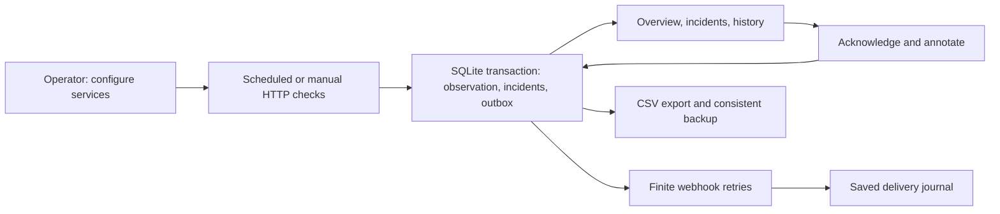

# SentinelNode: from HTTP checks to an operator workflow

Self-directed systems and monitoring project. The private application runs on a computer or server; its explicit demonstration uses real loopback HTTP. The separate AWS dashboard has checked infrastructure configuration, with live cloud deployment pending.

## Problem

The starting project checked a few hardcoded endpoints and displayed their most recent status. A successful old snapshot could continue looking healthy after the monitor stopped. Checks ran sequentially, the cloud execution budget was shorter than the combined configured waits, and the deployment directory contained Windows-specific dependencies for a Linux runtime.

## Changes

The monitor now validates operator-defined endpoints, checks up to eight services concurrently, and distinguishes successful, slow, failed, and timed-out responses. It records incidents once, updates ongoing incidents, and resolves them after a healthy check. A small rolling history retains sampled status and latency observations.

The dashboard makes freshness a separate signal from service health. Old or unavailable observations become unknown, while the last observed result remains visible for diagnosis. Current success counts disappear when the data is no longer trustworthy.

Incident alerts now have a durable outbox, stable event IDs, bounded backoff, and separate delivery history. An unavailable receiver can leave notifications queued while the monitored service recovers. The loopback receiver saves a notification before deliberately losing its reply; the retry reaches the same ID and produces one unique receipt from two requests. Delivery failure is kept separate from observed service health.

A local incident lab provides actual HTTP services whose behavior can be changed deliberately. It demonstrates slow responses, HTTP failures, paused telemetry, and recovery without requiring cloud accounts or presenting sample data as live customer infrastructure.

The 1.0 application gives one operator the full workflow: add and configure services, schedule or run checks, investigate and acknowledge incidents, confirm recovery, inspect and retry delivery, and export or back up the records. Live mode starts empty. Its separate demonstration seeds two loopback services and a local receiver. A portable Python archive includes the dashboard and requires no runtime packages.

SQLite replaces paired files in this application. The observation, incident changes, and notification outbox commit in one transaction. Incident annotations and the delivery journal persist independently of the bounded working snapshot. A process lock prevents competing instances from owning one state directory. Administration stays on loopback, with host/origin checks and a session token for browser mutations. A database backup restores into a new directory with checks and notifications paused for inspection.

The cloud configuration uses a private S3 origin behind CloudFront, uploads its frontend assets, restricts the monitor's S3 permissions to the telemetry objects, and serializes writes. A clean, pinned SDK package replaces the prebuilt platform-specific directory.

## Evidence and tradeoffs

A review found two history failure cases: malformed optional history could make a valid current observation unavailable, and a partially completed write could show history newer than the displayed status snapshot. History now has its own validation and timestamp boundary. The new unit and browser checks demonstrate that valid current health remains available when optional history fails, without implying that a newer check completed.

The current application passed 163 checks across application behavior, browser scenarios, and a mocked infrastructure scenario. Guided service setup keeps advanced options optional, notification actions explain their prerequisites, and the history chart exposes exact timestamps and response values through pointer and keyboard controls. Missing HTTP replies appear as gaps; rapid filter changes cannot replace the selected results with an older response. A separate [35-workflow live verification](live-verification.md) checks actual public websites, deliberate HTTP/TLS/DNS/timeout failures, real 30-second retries, eight concurrent local services, and persistence/restoration through the packaged program. It uncovered permission denials that could look like website outages and malformed URLs that could interrupt collection; both are corrected with regression coverage. The full [verification record](validation.md) records completed releases and links their fresh Linux runs. The original HTTP recording remains unchanged: five unique notifications from six accepted requests.

The implementation keeps a defined single-operator scope. It measures HTTP response headers and sampled availability rather than continuous uptime. Observation retention is bounded; durable incident and delivery journals require storage and backups. [Notification delivery](notifications.md) has finite retries and receiver deduplication. Teams, public admin login, process supervision, monitor-heartbeat alerts, and verified AWS notification integration remain outside 1.0. The [application guide](application.md) explains these operating boundaries.

## Separate cloud verification

An intentional cloud deployment requires resolved AWS account prerequisites and a representative authorized service. Both service failure and monitoring-path interruption must be observed before claiming deployed cloud operation. This is separate from the finished local application's workflow; local evidence establishes no cloud uptime or customer usage.
